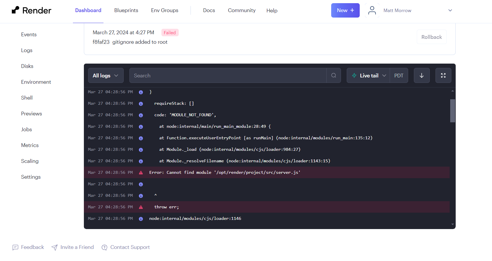

# PWA Text Editor

## Description
This project is meant to demonstrate Progressive Web Applications and generate a text editor deployed to Render.  It doesn't work correctly and I do not know why.  Moving on.

## Table of Contents
- [Installation](#installation)
- [Usage](#usage)
- [License](#license)
- [Contributing](#contributing)
- [Tests](#tests)
- [Questions](#questions)

## License
This project is not licensed.

## Contributing
Matt Morrow

## Render Link
https://github.com/mmorrow6109/Challenge19_PWA_texteditor
Does not work

## Screenshots

## Questions
For any questions, please contact [mmorrow6109](https://github.com/mmorrow6109) or email at msmorrow6109@gmail.com.
